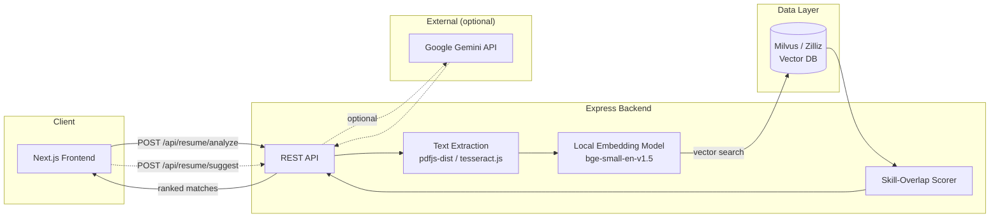
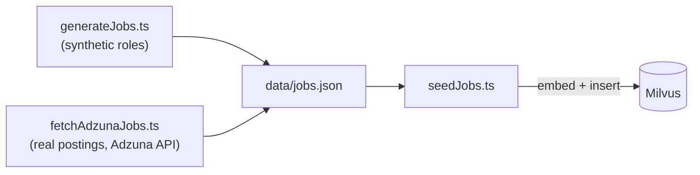
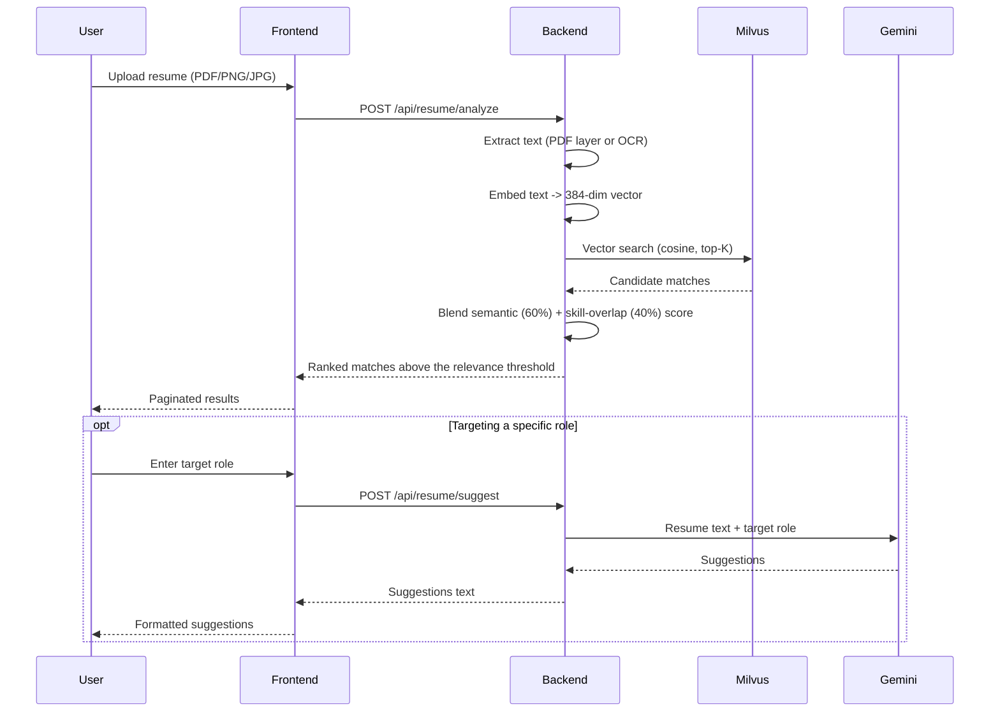

# JobSync


**Upload a resume, get back semantically matched jobs — powered by local embeddings and vector search, with zero API cost or key required for the core matching path.**

## Overview

JobSync is a full-stack resume-to-job matcher: upload a resume and it's ranked against a corpus of job descriptions by *meaning*, not keywords, using a local embedding model and a vector database. It's built as an end-to-end demonstration of a search product — file ingestion, ML inference, vector search, and an LLM-powered coaching feature — all wired together without depending on a paid embedding API for the part that matters most. The only external network call anywhere in the system is the optional Gemini-powered "improve your resume" feature.

## Problem Statement

Keyword-based search (what most ATS systems and job boards run on) misses roles that are a genuinely good fit but don't share exact vocabulary with a resume — a "Node.js backend engineer" and a "server-side JavaScript developer" posting can be the same job and never match. Manually reading through postings to judge fit doesn't scale past a handful of applications.

## Solution

Resume text is extracted, embedded into a vector, and compared against a pre-embedded job corpus using cosine similarity — so matching is based on overall meaning, not shared keywords. That semantic score is then blended with an explicit skill-overlap check to correct for cases where a resume's overall topic drifts from what a specific job actually asks for. On top of matching, a separate feature sends the resume and a target role to Gemini for concrete, role-specific improvement suggestions.

## Key Features

- **Drag-and-drop resume upload** — PDF (text layer) or PNG/JPG (OCR via Tesseract)
- **Local semantic embedding** — runs in-process on the backend, no API key or per-request cost
- **Vector similarity search** — Milvus with an HNSW index, cosine similarity
- **Skill-overlap rescoring** — corrects semantic drift by directly checking required-skill coverage
- **AI resume coaching** — role-targeted, actionable suggestions via Gemini (optional)
- **Paginated, ranked results** with a bookmark toggle and a full-detail modal per job
- **Resizable, collapsible sidebar** and a dark, glassmorphic UI

## Key Metrics / Results

Concrete numbers from the shipped project — this is a demo/portfolio build with no formal benchmark suite, so these are architectural facts, not accuracy claims:

- **10,005** seeded job listings across **450+** companies (`backend/src/data/jobs.json`)
- **384-dimension** embeddings (`bge-small-en-v1.5`, mean-pooled, L2-normalized)
- Up to **1,024** candidate matches retrieved per search (Zilliz Cloud's serverless search-limit ceiling)
- **5MB** upload limit, **3** supported input formats (PDF, PNG, JPEG)
- **0** external API calls on the core matching path — Gemini is opt-in and suggestions-only

## System Architecture



Job data is seeded offline, independent of the live request path:



## How It Works



## Technical Implementation

- **`embedding.service.ts`** — loads `bge-small-en-v1.5` once via `@xenova/transformers` and reuses it. Output is mean-pooled and L2-normalized, so cosine similarity reduces to a plain dot product wherever it's needed outside Milvus. Queries get a BGE-specific instruction prefix that passages don't, since the model is trained asymmetrically for retrieval.
- **`milvus.service.ts`** — owns the collection schema (`job_id`, `title`, `company`, `description`, `embedding`) and an HNSW index with a COSINE metric. Clamps the search `limit` to 1024 to work around a Zilliz Cloud serverless quirk (see below).
- **`skillMatch.service.ts`** — matches resume/job text against a curated keyword list with word-boundary-aware regex, and scores overlap as *(skills the resume has) / (skills the job asks for)*.
- **`textExtraction.service.ts`** — reads a PDF's embedded text layer directly (`pdfjs-dist`); for images, runs Tesseract OCR.
- **`aiSuggestions.service.ts`** — a thin Gemini wrapper with a fixed resume-coach system prompt, capped at 6 concrete suggestions per response.

## Technical Challenges & Solutions

- **Zilliz Cloud silently caps search results.** Exceeding a `limit` of 1024 on a serverless cluster doesn't error — it returns zero hits. *Fixed by clamping the requested `topK` to 1024 in `milvus.service.ts`, regardless of configuration.*
- **Raw cosine similarity looks low to end users.** Even a genuinely strong resume/job match rarely scores above ~0.6–0.7 cosine similarity, since the two texts are structured completely differently (achievements vs. requirements). *Fixed with a monotonic piecewise remap to a friendlier display percentage in `scoreTier.ts` — ranking is untouched, only the number shown to the user changes.*
- **A single embedding can be misled by a few stray keywords.** A frontend-heavy resume that happens to mention "deployed with Docker" can drift toward DevOps postings in pure semantic search. *Fixed by blending in an explicit skill-overlap score, so a job's actual required skills have to show up in the resume for that boost to apply.*
- **The Milvus SDK can crash the whole process.** Its gRPC client occasionally rejects a promise internally during its own connection retry logic — not tied to any call the app code awaits directly — which by default kills the entire Node process on any transient connectivity blip. *Fixed with a defensive `process.on("unhandledRejection")` handler in `server.ts` that logs and keeps the server alive.*

## Tech Stack

| Layer | Technology |
|---|---|
| Frontend | Next.js 15 (App Router), React 18, TypeScript, Tailwind CSS, Framer Motion, lucide-react |
| Backend | Node.js, Express 4, TypeScript |
| Embeddings | `@xenova/transformers` (local, in-process), `bge-small-en-v1.5`, 384 dimensions |
| Text extraction | `pdfjs-dist` (PDF text layer), `tesseract.js` (OCR for images) |
| Vector database | Milvus (Docker Compose) or Zilliz Cloud — HNSW index, cosine similarity |
| AI suggestions | Google Gemini (`@google/genai`, `gemini-flash-latest`) |
| Infra | Docker Compose (etcd, MinIO, Milvus standalone) |

## Project Structure

```
backend/
  src/
    server.ts                   # Express app entry
    config/env.ts               # env vars + defaults
    routes/resume.routes.ts     # POST /api/resume/analyze, /api/resume/suggest
    controllers/
      resume.controller.ts      # extract -> embed -> search -> rescore
      suggestions.controller.ts # AI suggestions request handling
    services/
      textExtraction.service.ts # PDF text / OCR extraction
      embedding.service.ts      # local embedding model
      milvus.service.ts         # Milvus collection + search
      skillMatch.service.ts     # keyword skill-overlap scoring
      aiSuggestions.service.ts  # Gemini API call
    scripts/
      generateJobs.ts           # generates data/jobs.json (role templates)
      fetchAdzunaJobs.ts        # appends real postings from the Adzuna API
      seedJobs.ts               # embeds + inserts jobs into Milvus
    data/jobs.json              # job descriptions used for seeding
    types/index.ts              # JobDescription / JobMatch
frontend/
  app/
    layout.tsx / page.tsx / globals.css
    icon.tsx / apple-icon.tsx   # generated favicon + touch icon
  components/
    Sidebar.tsx                 # draggable/collapsible nav
    UploadPanel.tsx             # drag-and-drop resume upload
    ResultsPanel.tsx            # paginated job match grid
    JobCard.tsx
    JobDetailModal.tsx          # full posting, opened by clicking a card
    ResumeSuggestions.tsx       # target-role input + AI suggestions
    BackgroundGlow.tsx          # decorative glass backdrop
    Logo.tsx
  lib/
    api.ts                      # calls the backend
    types.ts
    scoreTier.ts                # match-score -> percent + styling
    useJobActions.ts            # save/apply behaviour shared by card + modal
    logoPath.ts                 # logo vector paths
    cn.ts                       # classname helper
  next.config.mjs               # proxies /api/* to the backend
docker-compose.yml              # Milvus standalone stack
```

## API Documentation

**`GET /health`**
Liveness check. Returns `200 { "status": "ok" }`.

**`POST /api/resume/analyze`**
`multipart/form-data`, field name `resume` — PDF, PNG, or JPEG, ≤5MB.

Response `200`:
```json
{
  "matches": [{ "jobId": "...", "title": "...", "company": "...", "description": "...", "score": 0.0 }],
  "resumeText": "..."
}
```
Errors: `400` no file / unsupported type or too large · `422` couldn't extract enough text (e.g. a scanned PDF with no text layer) · `500` unexpected failure.

**`POST /api/resume/suggest`**
JSON body: `{ "resumeText": string, "targetRole": string }` (resume ≤20,000 chars, role ≤200 chars).

Response `200`: `{ "suggestions": "..." }`

Errors: `400` missing/empty/too-long field · `503` `GEMINI_API_KEY` not configured · `502` Gemini rejected the key, rate-limited, or otherwise failed · `500` unexpected failure.

## Getting Started / Installation

```bash
git clone https://github.com/mohdsaqb/jobsync.git
cd jobsync
```

**Prerequisites:** Node.js 18+, Docker Desktop (for running Milvus locally).

### 1. Start Milvus

If Docker Desktop isn't installed yet:

```bash
brew install --cask docker
```

Then **open Docker Desktop once manually** from Applications — it needs to walk through its first-run setup and license agreement (can't be automated). Wait until `docker info` succeeds.

From the project root, start Milvus and its dependencies (etcd, MinIO):

```bash
docker compose up -d
```

Give it 30–60 seconds to become healthy the first time. Check with `docker ps`.

### 2. Set up and seed the backend

```bash
cd backend
cp .env.example .env
npm install
npm run seed   # embeds and inserts the job descriptions into Milvus (one-time)
```

The repo ships with `backend/src/data/jobs.json` already populated with 10,005 job descriptions across software/tech, core engineering, and non-tech roles — so `npm run seed` has a large, varied pool to match resumes against out of the box.

**To enable AI resume suggestions**, add a Gemini API key to `backend/.env`:

```
GEMINI_API_KEY=...
```

Get a free key at [aistudio.google.com/apikey](https://aistudio.google.com/apikey). This is optional — matching, OCR, and embeddings all work without it. Without a key, the "Improve your resume" section shows a message that it isn't configured yet, instead of erroring.

To regenerate the job pool or start over:

```bash
npm run generate:jobs   # regenerates data/jobs.json with a fresh synthetic set
npm run seed:reset      # drops the existing Milvus collection and re-seeds it
```

### 3. Run the backend

```bash
npm run dev
```

The API listens on `http://localhost:4000`.

### 4. Run the frontend

In a separate terminal:

```bash
cd frontend
npm install
npm run dev
```

Open `http://localhost:3000`, upload a resume, and see your matched jobs. The frontend proxies `/api/*` to the backend on port 4000 (`frontend/next.config.mjs`), so both servers need to be running.

**UI tour:**

- The **sidebar** is a real resizable panel — drag its right edge, or drag past a threshold and release to snap into an icon-only rail.
- Upload a resume and the view transitions into a **results screen**, 20 matches per page, with Prev/Next and a jump-to-page control.
- Jobs scoring **10% or below** are filtered out server-side, so you won't see irrelevant postings.
- Click any **job card** to open its full posting in a modal, with the same Save/Apply actions.
- Each job has a working **bookmark toggle** (persisted in `localStorage`). **Apply** is a demo affordance — postings are synthetic, so it shows a note instead of linking anywhere real.
- The **"Improve your resume"** section asks what role you're targeting, then returns specific, role-tailored suggestions from Gemini — missing keywords, weak bullets, structural issues.

## Testing

There's no automated test suite yet (see Future Improvements) — verify changes manually:

1. `cd backend && npx tsc --noEmit && npm run build` — typecheck and confirm the backend compiles.
2. `cd frontend && npx tsc --noEmit && npm run build` — same for the frontend.
3. With both dev servers running, upload a resume and confirm ranked matches appear.
4. Open a job card, toggle its bookmark, and confirm it persists across a page reload.
5. Enter a target role in the suggestions panel and confirm Gemini returns formatted, role-specific feedback (requires `GEMINI_API_KEY`).

## Future Improvements

- **Automated tests** — unit tests for the scoring/ranking logic, integration tests for the API endpoints.
- **A shared types package** — `JobMatch` is currently hand-duplicated between `backend/src/types` and `frontend/lib/types.ts`, with no compile-time guarantee they stay in sync.
- **Auth and rate-limiting** on the API endpoints — currently open to any caller.
- **OCR fallback for scanned PDFs** — image-only PDFs currently need to be re-uploaded as a PNG/JPG rather than being rasterized automatically.

## Closing

JobSync started as a way to build a real, working ML-backed search feature end-to-end — from raw file upload down to vector index internals — rather than gluing together a third-party search API. Issues and PRs are welcome.

**Built by Mohd Saqib** — [github.com/mohdsaqb](https://github.com/mohdsaqb)
